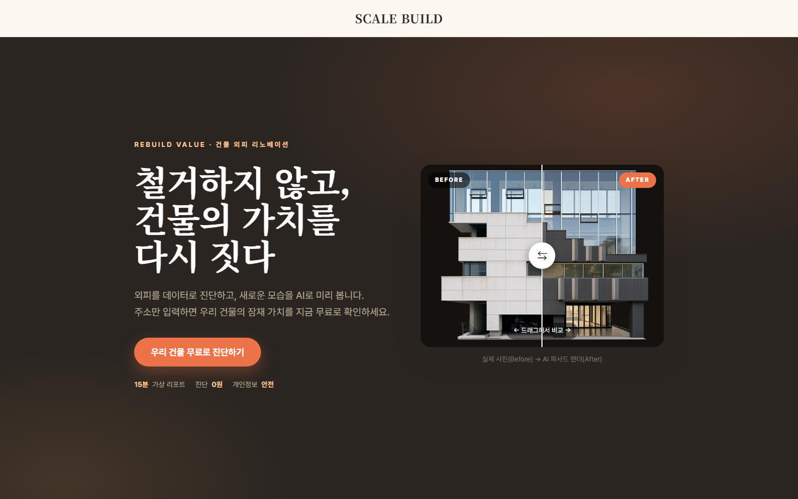

# SCALE BUILD 

**A marketing lead engine + open-data pipeline for a facade-renovation business targeting aging buildings in Seoul.** Built through vibe coding (Claude Code) during my internship at Scale Virtual.

> An AI-assisted lead funnel with facade-render preview, plus Python scripts that turn Korean government building-registry data into geocoded, priority-scored prospect maps.

> 🔒 **Source code lives in a private repository** — all personal data, prospect lists, and API keys are fully excluded. Access available on request — joengeunjumer@gmail.com

## ① Marketing Lead Funnel (web frontend)

Building owners enter an address, preview an **AI facade-renovation render** of their building, and convert to a consultation request. Static HTML/JS + Supabase — no server — deployed on Vercel.



- Key isolation by design: `config.js` (public) / `config.local.js` (injected from env vars at deploy time, never committed)
- Demo fallback: the whole funnel works without API keys using built-in demo renders

## ② Building-Registry Data Pipeline (Python)

Extracts and scores renovation-candidate buildings from Korean public building-registry data:

```
registry CSV ─→ filter (RC · commercial · size) ─→ suitability scoring (age sweet-spot curve) ─→ geocoding ─→ check-map (Leaflet) + mail-merge labels
```

- **Suitability algorithm** — older is not better: the score peaks in the "right-aged" band (~18–28 years) where exterior-only retrofit is feasible without structural work
- **Documented guardrails** — no automated crawling of government portals; data-acquisition steps stay human-only. The boundaries AI collaborators must not cross are written into the project's `CLAUDE.md`

## ③ Team Work Calendar (Node.js)

A single-file team calendar shared over the local office network (server.js + one HTML file).

## Tech Stack

HTML/CSS/JavaScript · Python (pandas · openpyxl) · Node.js · Supabase · Kakao/Naver Maps API · Vercel

## Vibe Coding Process

Each pipeline stage (parse → filter → geocode → map → labels) was developed script-by-script with Claude Code. The project's **`CLAUDE.md` handover document** — which gives an AI collaborator the project context and its guardrails — is itself part of the deliverable: designing the human↔AI collaboration workflow, not just the code.
